## 新手司机上路

### 用户界面说明

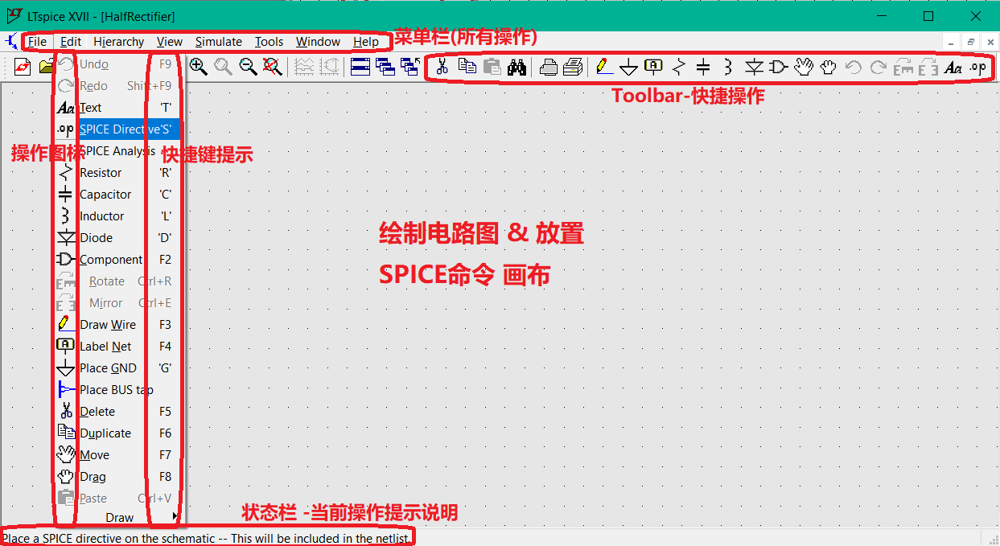

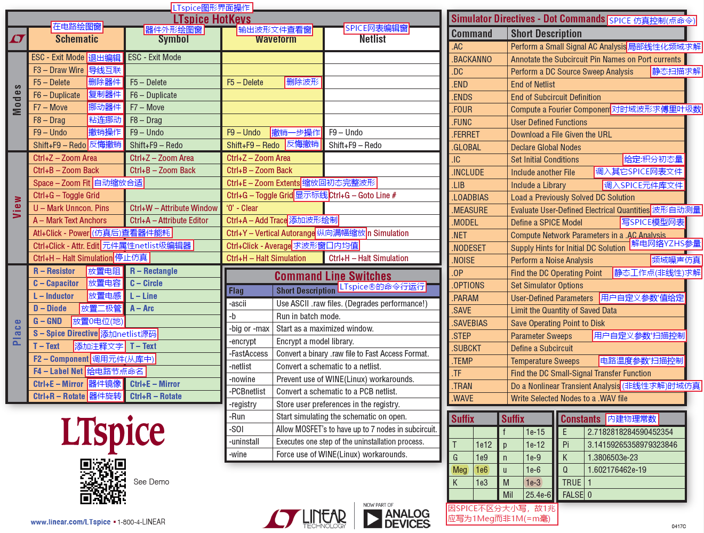

### 编辑电路图

自带元器件库Component中可以找到各类元器件

快捷键操作

```
R 放置电阻
D 放置二极管
G 放置GND
C 放置电容
L 放置电感
V 电压源
T 贴入 Comment注释文本
delete 调用剪刀删除器件
放置后  `F5`删除元件; `F6`复制元件; `F7`挪动元件; `F8`粘连挪动; `F9`撤销操作;空格旋转放置方向，Ctrl+E镜像放置方向
F2打开Component库搜索
```

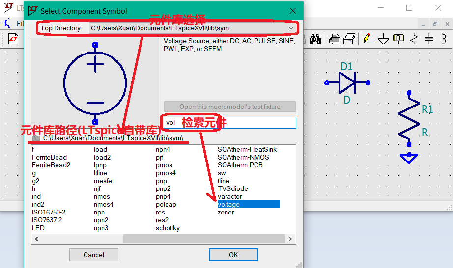

**绘制图操作**

```
F3 绘制导线
F4 对导线(电压节点 Node)命名(Label Net)
```

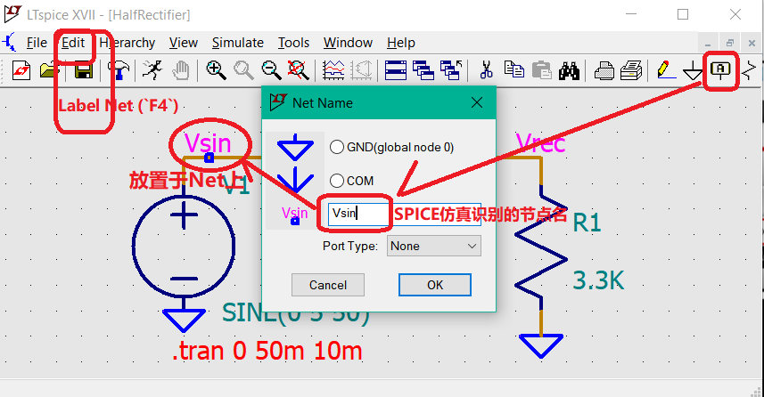

### 编辑元件参数

右键元件编辑元件参数

#### 单位设置

```
物理单位(Ohm, F, H等)加不加均可； 如电阻值3.3k (也可写成3.3e3)：

数量单位见 Help->LTspice®->Introduction->General… 说明：(备注：LTSPICE不区分大小写，故) 注意：兆 1e6可写作 Meg，而不能写作 M（=m, 毫）
```

#### 二极管编辑

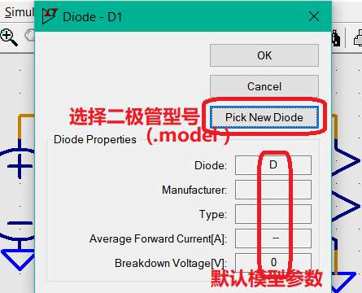

常见 高速小信号二极管 1N4148 （或大电流管 1N5819）等

#### voltage编辑电压源

正弦信号


### 设置仿真参数

#### 时域仿真

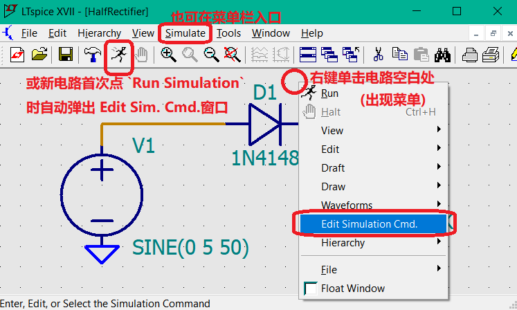

**配置时域（.tran ）仿真选项**

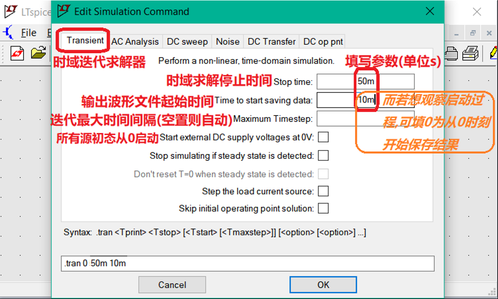

确定后 快捷键'S'直接编辑**SPICE命令**贴入电路图中

**编辑器里: (右键)`RMB`>Help me edit>Analysis Cmd 可调出写常用SPICE命令的各辅助向导**

**`Ctrl+S` 保存后run**

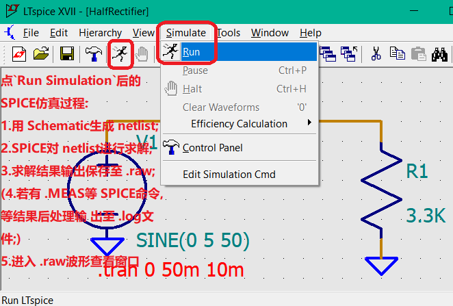

### 查看仿真输出

#### 电压、电流波形

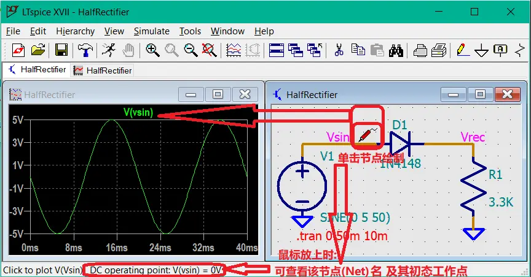

**用鼠标保持单击 Vsin导线并拖动至 输出Vrec节点以绘制 V(Vsin,Vrec)差分电压**

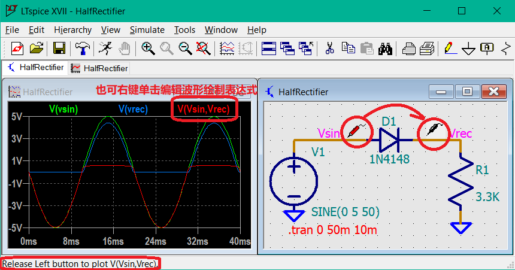

单击元件放置电流探头，alt+左键点击导线测导线电流，单机元件端口绘制端口电流


#### 波形细节查看

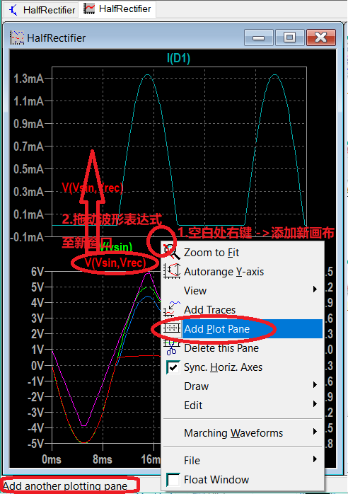

左键拉矩形框框选目标范围进行放大；`Ctrl+E` 恢复 full缩放，`Ctrl+E` 恢复 full缩放

**4-2-1** **左键单击用 Cursor测量波形数据点**

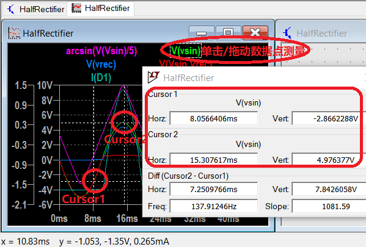

**4-2-2** **右键单击编辑波形后处理表达式**

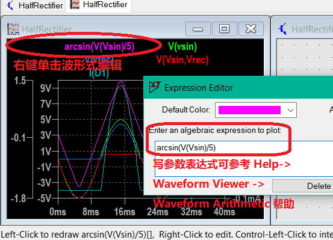

也可以直接在波形查看器中 右键-> Add trace，添加波形绘制表达式；

**4-2-3 ** **计算均值及有效值**

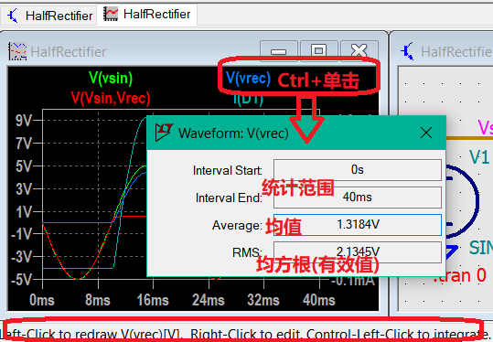

**4-2-4 波形查看器技巧：自变量选择：从时间函数替换成轨迹图 X-Y plot：**

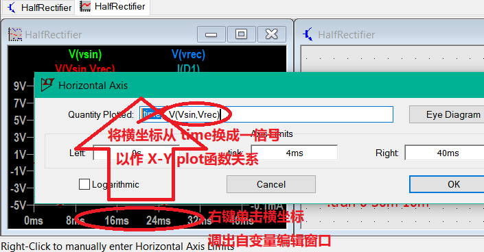


**4-2-5 输出log**  

ctrl +L


## 进阶使用

### 仿真不收敛

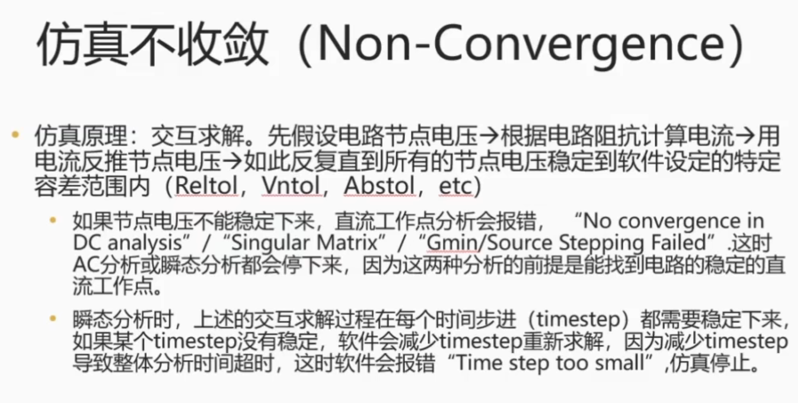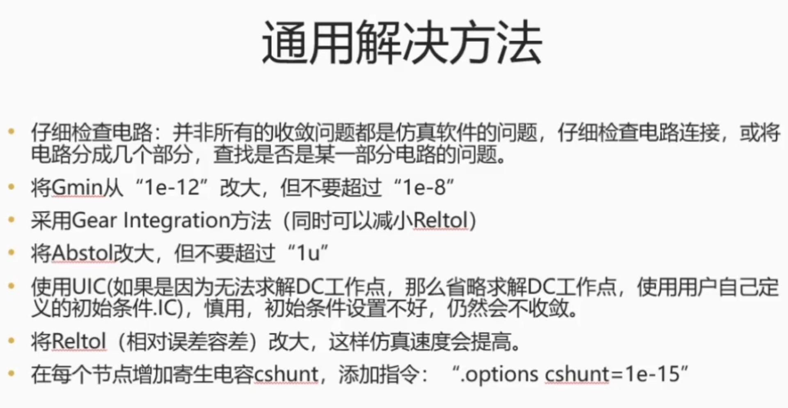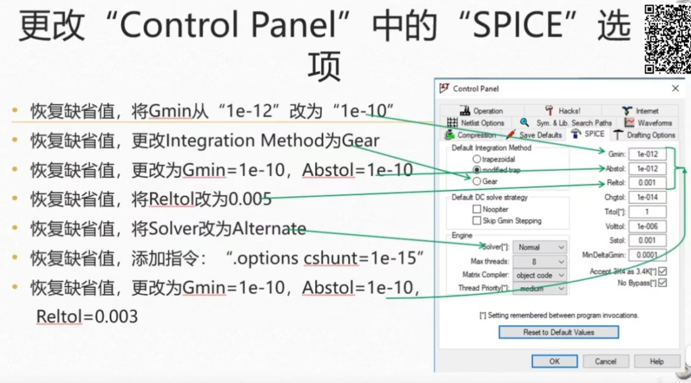

### spice模型导入

首先到元件官网下载spice模型，存放到自建的model_lib文件夹（路径全英文）下，解压。

用ltspice打开spice.txt文件或者.lib文件

打开后界面如下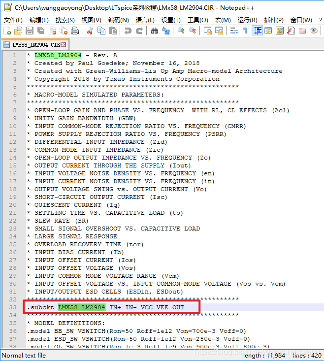

如果能找到“**.subckt**”命令，说明这就是一个子电路模型，后面紧接着就是模型名，然后是输入输出各个引脚名，如下图。复杂的模型或者某个文档中可能不止一个subckt，所以一定要找到正确的模型名。

左键双击目标元件的名称选中，右键后再命令栏中选择create component 打开封装编辑界面，检查引脚命名，双击可修改引脚名称，引脚定义参考上图中的引脚定义。另外，支持自建封装，然后把原封装的引脚直接移动过去（自搜教程）。确认封装无误后ctrl +s ,软件自动生成元件模型

然后即可在元件库搜索到该元件

若仿真中元件无法使用，则使用 .lib 命令把下载的模型中的 .lib文件等load进入工程

## 应用

### 音频调制

可以直接用wav文件作为电压激励，看看自己设计的电路还原声音如何，或者测试调制解调