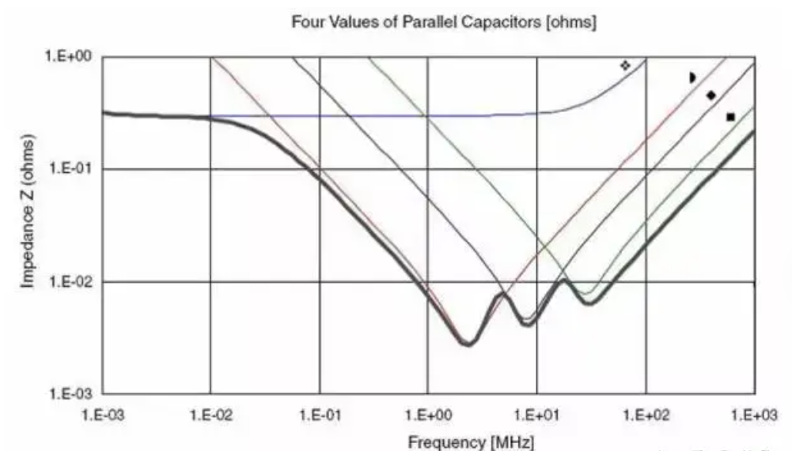
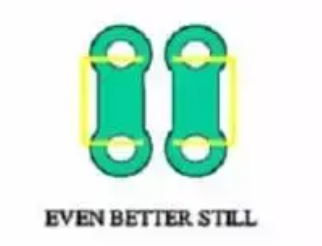
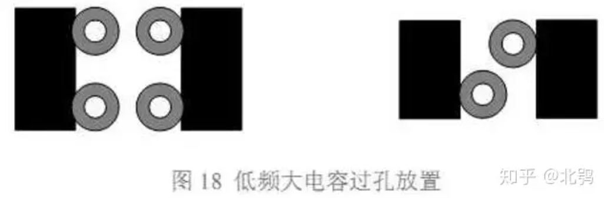
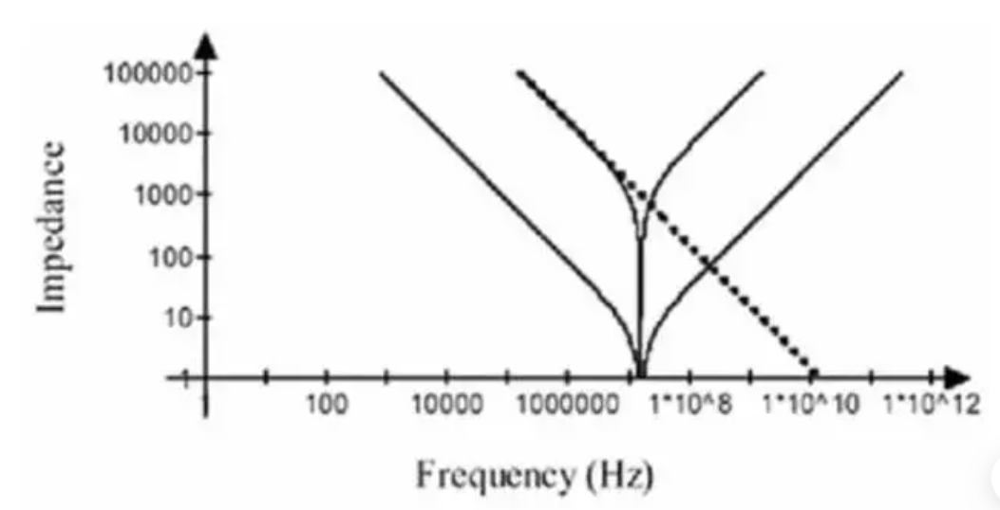
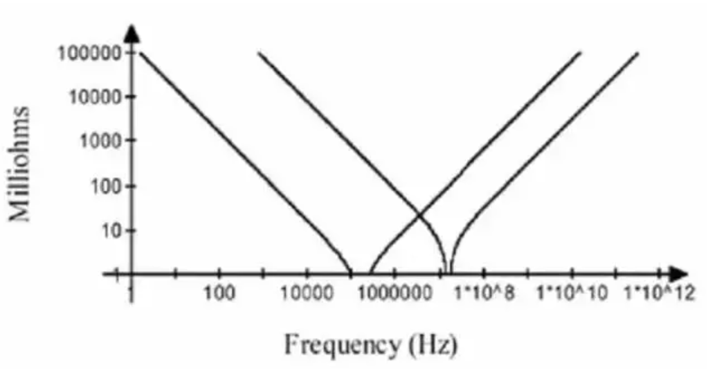
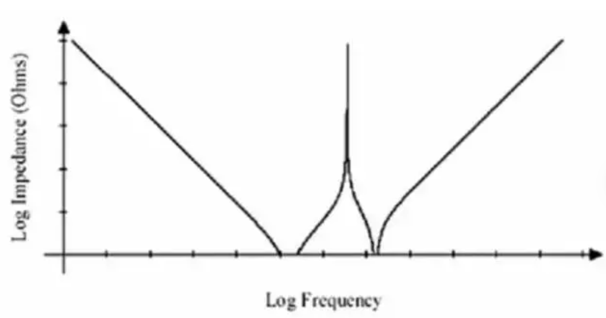

# 电源完整性学习笔记

## 简介

电源完整性是指电源波形的质量，研究的是电源分配网络(PDN)，并从系统供电网络综合考虑，消除或者减弱噪声对电源的影响。电源完整性的设计目标是把电源噪声控制在运行的范围内，为芯片提供干净稳定的电压，并使它能够维持在一个很小的容差范围内(通常为5%以内)，实时响应负载对电流的快速变化，并能够为其他信号提供低阻抗的回流路径。

## 设计考虑

1. **电源稳定性：** 保持电源电压的稳定性对于整个系统的正常运行至关重要。设计时需考虑电源波动、噪声和脉冲等因素，以确保电源提供稳定的电压和电流。
2. **电源纹波：** 电源输出中的纹波是指电压或电流的周期性波动。低纹波水平对于某些应用至关重要，特别是对于需要高精度和低噪声的电子系统。
3. **电源噪声：** 电源产生的噪声可能对系统中其他部分造成干扰。这包括高频噪声、尖峰噪声等，需要采取措施来降低这些噪声水平，例如使用滤波器和稳压器。
4. **电源过电压和过电流保护：** 设计中需要考虑采用适当的过电压和过电流保护装置，以防止电源异常时对系统组件造成损害。
5. **电源启动和关闭特性：** 电源的启动和关闭过程应该平滑，避免产生过大的电压和电流冲击，从而保护系统中的其他元件。
6. **电源效率：** 高效的电源设计有助于减少功耗和热量的产生，对于移动设备和电池供电系统尤为重要。
7. **EMI（电磁干扰）和RFI（射频干扰）：** 电源系统可能会引入电磁和射频干扰，影响系统的正常运行。设计中需要采取屏蔽和滤波等措施来减少这些干扰。
8. **热管理：** 电源元件在工作时可能产生热量，需要考虑散热设计，确保系统能够有效地散发产生的热量，以防止温度升高对系统性能和寿命造成不利影响。
9. **可靠性和稳定性：** 电源系统需要具有足够的可靠性，以确保系统在各种工作条件下都能正常运行。
10. **成本：** 电源设计需要在满足性能要求的前提下考虑成本因素，选择适当的元件和技术。

## 电源噪声

### 来源

- 稳压芯片自身的纹波，这只能靠选择更优秀的芯片（加钱）来降低影响
- 稳压电源无法实时响应负载对于电流需求的快速变化，当负载瞬态电流变化频率超出这一范围时， 稳压源的电压输出会出现跌落，从而产生电源噪声。
- **整流噪声：** 在电源中，整流电路将交流电源转换为直流电源。整流过程中的不完美性会导致波形失真和谐波产生，从而引入噪声。
- **开关电源的开关干扰：** 在开关电源中，开关元件的切换会导致电流和电压的突变，产生高频噪声。这种噪声可能通过电源线传播到整个系统。
- **地回路噪声：** 由于地回路共享，地回路中的电流可能产生不同部分之间的电压差，从而引入地回路噪声
- **非线性负载：** 当系统中的负载发生变化时，电源的电流需求可能会发生不连续的变化，引入噪声。
- **电容器和电感元件的噪声：** 电容器和电感器在工作时可能引入噪声。电容器的瞬态响应和电感器的磁场变化都可能导致电源噪声。

等等。

### 去耦设计

有的资料上说要对个电源引脚加去耦电容，而另一些资料并不是按照个电源引脚都加去偶电容来设计的，只是说在芯片周围放置多少电容，然后怎么放置，怎么打孔等等。那么到底哪种说法及做法 正确呢？我在刚接触电路设计的时候也有这样的困惑。其实，两种方法都是正确的，只不过处理问题的角度不同。

#### **利用目标阻抗计算电容（设计思想很严谨，要吃透）**

为了清楚的说明电容的计算方法，我们用一个例子。要去耦的电源为 1.2V，容 许电压波动为 2.5%，最大瞬态电流 600mA，

目标阻抗
$$
X_{MAX}=\frac{V_{DD}*Ripple}{\Delta I_{MAX}}=50m\ohm
$$
第二，确定稳压电源频率响应范围

和具体使用的电源片子有关，通常在 DC 到几百 kHz 之间。这里设为 DC 到 100kHz。在 100kHz 以下时，电源芯片能很好的对瞬态电流做出反应，高于 100kHz 时， 表现为很高的阻抗，如果没有外加电容，电源波动将超过允许的 2.5%。

第三，计算bulk电容

当频率处于电容自谐振点以下时，电容的阻抗可近似表示为：
$$
Z_c=\frac{1}{2\pi f C}
$$
频率 f 越高，阻抗越小，频率越低，阻抗越大。在感兴趣的频率范围内，电容的 最大阻抗不能超过目标阻抗，因此使用 100kHz 计算（电容起作用的频率范围的最低频率，对应电容最高阻抗）。
$$
C=\frac{1}{2\pi fX_{MAX}}=31.831
$$
当频率处于电容自谐振点以上时，电容的阻抗可近似表示为：
$$
Z_C=2\pi fX_{MAX}
$$
频率 f 越高，阻抗越大，但阻抗不能超过目标阻抗。假设 ESL 为 5nH，则最高有效频率为
$$
f_{max}=\frac{X_{MAX}}{2\pi ESL}=1.6MHz
$$
如果希望电源系统在 500MHz 以下时都能满足电压波动要求，就必须控制电容的 寄生电感。必须满足 2πf×Lmax≤XMAX ，所以有：
$$
L_{MAX}\leq \frac{X_{MAX}}{2\pi *500MHz}=0.016nH
$$
假设使用 AVX 公司的 0402 封装陶瓷电容，寄生电感约为 0.4nH，加上安装到电 路板上后过孔的寄生电感（本文后面有计算方法）假设为 0.6nH，则总的寄生电感为 1 nH。为了满足总电感不大于 0.16 nH 的要求，我们需要并联的电容个数为：1/0.016=62.5 个，因此需要 63 个 0402 电容。为了在 1.6MHz 时阻抗小于目标阻抗，需要电容为：
$$
C=\frac{1}{2\pi 1.6MHz*X_{max}}=1.9894uF
$$
因此个电容的电容为 1.9894/63=0.0316 uF。

综上所述，对于这个系统，我们选择 1 个 31.831 uF 的大电容和 63 个 0.0316 uF 的小电容即可满足要求。

#### **选择电容组合**

瞬态电流的变化相当于阶跃信号，具有很宽的频谱。因而，要对这一 电流需求补偿，就必须在很宽的频率范围内提供足够低的电源阻抗。但是，不同电容的有效 频率范围不同，这和电容的谐振频率有关（严格来说应该是安装后的谐振频率） ，有效频率范围（电容能提供足够低阻抗的频率范围）是谐振点附近一小段频率。因此要在很宽的频率范围内提供足够低的电源阻抗，就需要很多不同电容的组合。

通常，用**钽电容或电解电容**来进行板级低频段去耦。这两种电容的 Q 值很低，频率选择性不强，非常适合板级滤波。

高频小电容的选择有些麻烦，需要**分频段计算**。可以把需要去耦的频率范围分成几段， 一段单独计算，用多个相同容值电容并联达到阻抗要求，不同频段选择的不同的电容值。但这种方法中，频率段的划分要根据计算的结果不断调整.一般划分 3 到 4 个频段就可以了，这样需要 3 到 4 个容值等级。

**设计时要注意，尽不要让时钟频率的各次谐波落在反谐振频率附近。**

还有一点要注意，容值的等级不要超过 10 倍。比如你可以选类似 0.1、0.01 、0.001 这样的组合。因为这样可以有效控制反谐振点阻抗的幅度， **间隔太大， 会使反谐振点阻抗很大。**当然也不是绝对的。最好的办法就是先粗略计算一下大致的组合，然后用电源完整性仿真软件做仿真，再做局部调整，能满足目标阻抗要求即可，可以把电源平面 的电容也加进来，联合设计。

图 13 是一个电容组合的例子。这个组合中使用的电容为：2 个 680uF 钽电容， 7 个 2.2uF 陶瓷电容（0805 封装） ，13 个 0.22uF 陶瓷电容（0603 封装） ，26 个 0.022uF 陶 瓷电容（0402 封装） 。图中，上部平坦的曲线是 680uF 电容的阻抗曲线，其他三个容值的 曲线为图中的三个 V 字型曲线，从左到右一次为 2.2uF、0.22uF、0.022uF。总的阻抗曲线 为图中底部的粗包络线。这个组合实现了在 500kHz 到 150MHz 范围内保持电源阻抗在 33 毫欧以下。到 500MHz 频率点处，阻抗上升到 110 毫欧。从图中可见，反谐振点的阻抗控制得很低。

小电容的介质一般常规设计中都选则**陶瓷电容**。NP0 介质电容的 ESR 要低得多，对于 有更严格阻抗控制的局部可以使用，但是注意这种电容的 Q 值很高，可能引起严重的**高频振铃**，使用时要注意。

封装的选择，只要加工能力允许，当然越**小**越好，这样可以得到**更低的 ESL**，也可以留 出更多的布线空间。但不同封装，电容谐振频率点不同，容值范围也不同，可能影响到最终 的电容数。因此，电容封装尺寸、容值要联合考虑。总之最终目标是，用最少的电容达到 目标阻抗要求，轻安装和布线的压力。

#### **电容的去耦半径**

大多数资料中都会提到电容摆放要尽靠 近芯片，多数资料都是从小回路电感的角度来谈这个摆放距离问题。还有一个重要的原因大多数资料都没有提及，那就是电容去耦半径问题。

**如果电容摆放离芯片过远，超出了它的去耦半径，电容将失去它的去耦的作用。**

理解去耦半径最好的办法就是**考察噪声源和电容补偿电流之间的相位关系**。当芯片对电 流的需求发生变化时，会在电源平面的一个很小的局部区域内产生电压扰动，电容要补偿这 一电流（或电压），就必须先感知到这个电压扰动。信号在介质中传播需要一定的时间，因 此从发生局部电压扰动到电容感知到这一扰动之间有一个时间延迟。同样，电容的补偿电流 到达扰动区也需要一个延迟。因此必然造成噪声源和电容补偿电流之间的相位上的不一致。特定的电容，对与它自谐振频率相同的噪声补偿效果最好，我们以这个频率来衡这种相位 关系。设自谐振频率为 f，对应波长为λ，补偿电流表达式可写为：
$$
I=Ae^{j2\pi \frac{2R}{c}}
$$
其中，A 是电流幅度，R 为需要补偿的区域到电容的距离，C 为信号传播速度。

当扰动区到电容的距离达到λ/4 时，补偿电流的相位为π ，和噪声源相位刚好差 180 度，即完全反相。此时补偿电流不再起作用，去耦作用失效，补偿的能无法及时送达。为 了能有效传递补偿能，应使噪声源和补偿电流的相位差尽可能的小，最好是同相位的。距离越近，相位差越小，补偿能传递越多，如果距离为 0，则补偿能百分之百传递到扰动 区。这就要求噪声源距离电容尽可能的近，要远小于λ/4 。

实际应用中，这一距离最好控 制在**λ/40~λ/50** 之间，这是一个验数据。 例如：0.001uF 陶瓷电容，如果安装到电路板上后总的寄生电感为 1.6nH，那么其安装 后的谐振频率为 125.8MHz，谐振周期为 7.95ps。假设信号在电路板上的传播速度为 166ps/inch，则波长为 47.9 英寸。电容去耦半径为 47.9/50=0.958 英寸，大约等于 2.4 厘 米。

对于大电容，因为其谐振频率很低， 对应的波长非常长，因而去耦半径很大，这也是为什么我们不太关注大电容在电路板上放置位置的原因。(**大电容不用管**)对于小电容，因去耦半径很小，应尽可能的靠近需要去耦的芯片，这正是大多 数资料上都会反复强调的，小电容要尽可能近的靠近芯片放置。（**小电容靠近芯片**）

#### 电容过孔安装方式

按优先级排列

1. 在焊盘上直接打孔，寄生电感最小，但是焊接是可能会出现问题，是否使 用要看加工能力和方式。
2. 在焊盘两侧都打孔，和第三种方法相比，相当于电容一端都是通过过孔的并联接入电源平面和地平面，比第三种寄生电感更小，只要空间允许，尽用这种方法。
3. 在焊盘侧面打孔，进一步小了回路面积，寄生电感比第二种更小，是比较好的 方法。

**有些工程师为了节省空间，有时让多个电容使用公共过孔。任何情况下都不要这样做。最好想办法优化电容组合的设计，减少电容数。**

**由于印制线越宽，电感越小，从焊盘到过孔的引出线尽加宽，如果可能，尽和焊盘 宽度相同。**

对于**大尺寸的电容**，比如板级滤波所用的钽电容

## 元件知识补充

### 电容

#### 电容安装谐振频率

当电容安装到电路板上后， 还会引入额外的寄生参 数，从而引起谐振频率的偏移。充分理解电容的自谐振频率和安装谐振频率非常重要，在计 算系统参数时，实际使用的是安装谐振频率，而不是自谐振频率，因为我们关注的是电容安 装到电路板上之后的表现。

电容在电路板上的安装通常包括一小段从焊盘拉出的引出线，两个或更多的过孔。我们 知道，不论引线还是过孔都存在寄生电感。寄生电感是我们主要关注的重要参数，因为它对 电容的特性影响最大。电容安装后，可以对其周围一小片区域有效去耦，这涉及到去耦半径 问题，本文后面还要详细讲述。现在我们考察这样一种情况，电容要对距离它 2 厘米处的 一点去耦，这时寄生电感包括哪几部分。首先，电容自身存在寄生电感。从电容到达需要去 耦区域的路径上包括焊盘、一小段引出线、过孔、2 厘米长的电源及地平面，这几个部分都 存在寄生电感。相比较而言，过孔的寄生电感较大。可以用公式近似计算一个过孔的寄生电 感有多大。 公式为
$$
L= 5.08*[ln(4h/d)+1]
$$
其中：L 是过孔的寄生电感，单位是 nH。h 为过孔的长度，和板厚有关，单位是英寸。d 为过孔的直径，单位是英寸。下面就计算一个常见的过孔的寄生电感，看看有多大，以便 有一个感性认识。设过孔的长度为 63mil（对应电路板的厚度 1.6 毫米，这一厚度的电路板 很常见） ，过孔直径 8mil，根据上面公式得：
$$
L = 1.4242nH
$$
这一寄生电感比很多小封装电容自身的寄生电感要大， 必须考虑它的影响。过孔的直 径越大，寄生电感越小。过孔长度越长，电感越大。下面我们就以一个 0805 封装 0.01uF 电容为例，计算安装前后谐振频率的变化。参数如下：容值：C=0.01uF。电容自身等效 串联电感：ESL=0.6 nH。安装后增加的寄生电感：Lmount=1.5nH。

电容的自谐振频率：
$$
f_0 =\frac{1}{2\pi\sqrt{ESL*C}}=64.975MHz
$$
安装后的总寄生电感：0.6+1.5=2.1nH。注意，实际上安装一个电容至少要两个过孔，寄 生电感是串联的，如果只用两个过孔，则过孔引入的寄生电感就有 3nH。但是在电容的 一端都并联几个过孔，可以有效小总的寄生电感，这和安装方法有关。

安装后的谐振频率为：
$$
f_0 =\frac{1}{2\pi\sqrt{ESL*C}}=34.73MHz
$$
可见，安装后电容的谐振频率发生了很大的偏移，使得小电容的高频去耦特性被消弱。在进行电路参数设计时，应以这个安装后的谐振频率计算，因为这才是电容在电路板上的实际表现。

#### 相同容值电容的并联

使用很多电容并联能有效地小阻抗.63 个 0.0316 uF 的小电容 （个电容 ESL 为 1 nH）并联的效果相当于一个具有 0.159 nH ESL 的 1.9908 uF 电容。

单个电容及并联电容的阻抗特性如图。并联后仍有相同的谐振频率，但是 并联电容在一个频率点上的阻抗都小于单个电容。

从图中我们看到，阻抗曲线呈 V 字型，随着频率偏离谐振点，其阻抗仍然 上升的很快。要在很宽的频率范围内满足目标阻抗要求，需要并联大的同值电容。这 不是一种好的方法，造成极大地浪费。有些人喜欢在电路板上放置很多 0.1uF 电容，如果你设计的电路工作频率很高，信号变化很快，那就不要这样做，最好使用不同容值的 组合来构成相对平坦的阻抗曲线。

#### 不同容值电容的并联与反谐振

容值不同的电容具有不同的谐振点。左边谐振点之前，两个电容都呈容性，右边谐振点后，两个电容都呈感性。在两个谐振 点之间，阻抗曲线交叉，在交叉点处，左边曲线代表的电容呈感性，而右边曲线代表的电容 呈容性，此时相当于 LC 并联电路。对于 LC 并联电路来说，当 L 和 C 上的电抗相等时， 发生并联谐振。因此，两条曲线的交叉点处会发生并联谐振，这就是反谐振效应，该频率点 为反谐振点。电导 G=jwc2+1/jwL1,未考虑 ESR

两个容值不同的电容并联后， 阻抗曲线如图 。

- 不同容值的电容并联， 其阻抗特性曲线的底部要比图 10 阻抗曲线的底部平坦得多 （虽然存在反谐振点，有一个阻抗尖峰） ，因而能更有效地在很宽的频率范围内小阻抗。
- 在反谐振（Anti-Resonance）点处，并联电容的阻抗值无限大，高于两个电容任何一个单 独作用时的阻抗。并联谐振或反谐振现象是使用并联去耦方法的不足之处。

在并联电容去耦的电路中， 虽然大多数频率值的噪声或信号都能在电源系统中找到低 阻抗回流路径，但是对于那些频率值接近反谐振点的，由于电源系统表现出的高阻抗，使得 这部分噪声或信号能无法在电源分配系统中找到回流路径，最终会从 PCB 上发射出去 （空气也是一种介质，波阻抗只有几百欧姆） ，从而在反谐振频率点处产生严重的 EMI 问题。因此，并联电容去耦的电源分配系统一个重要的问题就是：**合理的选择电容，尽可能的压低反谐振点处的阻抗。**

**ESR 对反谐振（Anti-Resonance）的影响**

反谐振点处的阻抗为
$$
Z=\frac{ESR}{2} +\frac{X^2}{2ESR}
$$
其中，X 为反谐振点处单个电容的阻抗虚部（均相等）

现代工艺生产的贴片电容，等效串联阻抗很低，因此就有办法控制电容并联去耦时反谐振点处的阻抗。等效串联电阻ESR使整个电源分配系统的阻抗特性趋于平坦。